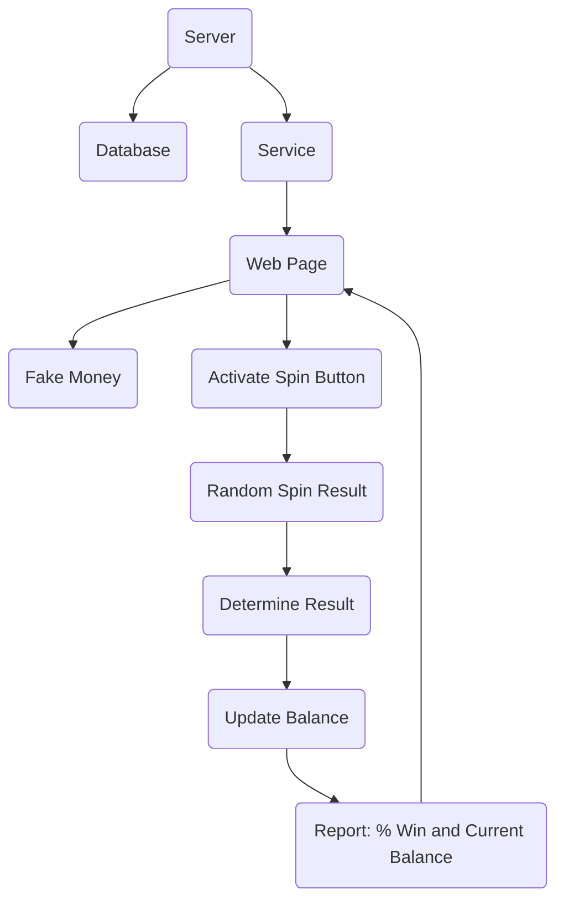
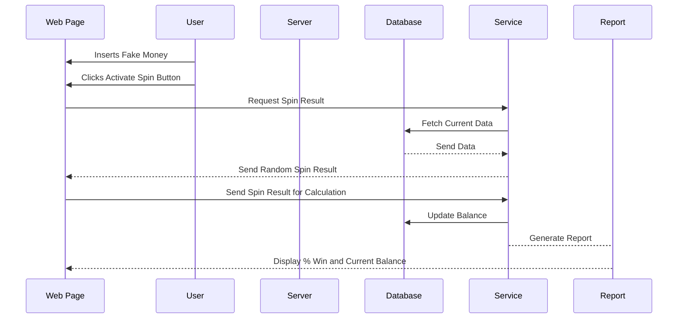
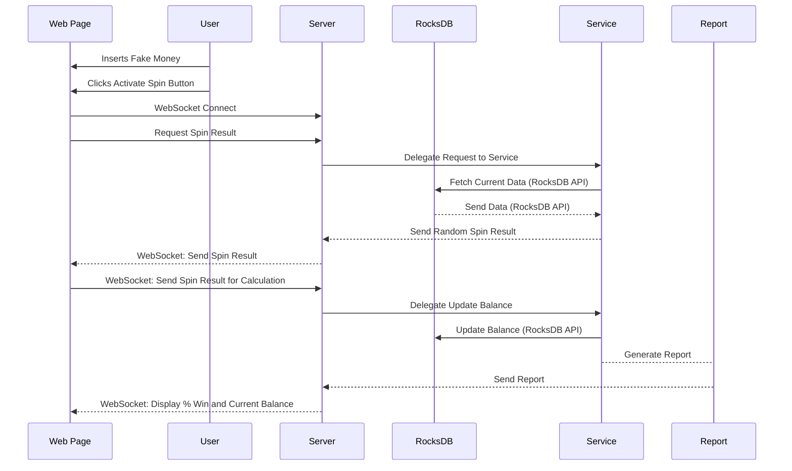
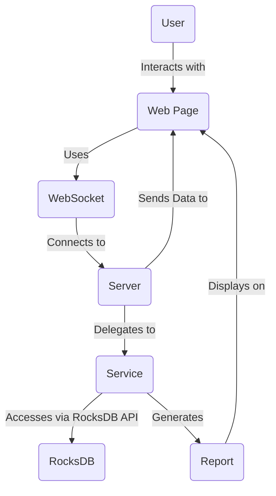

# Product Development Cradle to Grave - Part 1

This series of articles is designed as a tutorial for how to write a portable full stack service using modern techniques. I will take you on a journey from concept through deployment. The series will be detailed and therefore is closer to a book than a bunch of blog posts. Hopefully we'll all learn something along the way. I'll strive to make the series useful for software engineers at any point in their career. I will incorporate how I approach doing product development which has worked well when working with teams over my career.

# Converting a Concept to a Commitment

A concept can come from anyone. In any product development someone must play the role of product manager. The product manager decides if a concept can be developed, funded and become an asset in the portfolio they responsible for. Most businesses are successful because they solve a problem better than other businesses by providing a product or service with a positive return on investment (ROI).

For this series, I'm playing all roles for illustration purposes. This is unusual, but it is not unrealistic. Few companies can afford to staff each role in product development with a dedicated resource. This requires employees to play different roles. I'll refrain from the issues regarding individuals capabilities to perform the roles they have been assigned (explicitly or implicitly), instead I will assume every role is staffed properly.

When a concept is proposed by the product manager, it is necessary to determine what it will cost to develop it as soon as possible. If the estimate has a digestible cost/benefit ratio (ROI). This normally communicated using a written report or is the result of a number of discussions.

The communication addresses the following:

- A description of the problem the product solves for targeted customers
- A straw man proposal of the features a product provides to solve the problem
- Proposals for how to solve the problem
- Proposals for the User Experience (UX) expected
- A straw man system and software architecture
- A straw man estimate of the resources required to take the product from "cradle to grave"

Given this information ROI can be estimated. The volume of revenue can be estimated which determines the value of the product. If the profits expected are attractive and the non-recoverable expense (NRE) is affordable, a project to start building the product is approved and the product manager commits to delivering it.

For the moment, none of these issues are relevant to the objective of demonstrating how to write a portable full stack service. Therefore, I will address these issues in other articles. For now, I'll assume the project to start building the product has been approved and just get down to work. After all, I'm funding the product development myself so I can do whatever I want :)

# Concept: Rock Your Slots Off

I was recently asked how to take data stored in a RocksDB and report it using a web page. To answer this question using some research I've decided to create a **slot machine simulator** as the basis of a fictional "Rock Your Slots Off" product. This is a pun on "Rock your Socks Off", which hopefully makes people want to use it.

I want it to be usable from a browser, desktop or mobile device. Therefore a service running on a server in the cloud is needed. I'll host it on a website I've been running for years and interact with it using various clients. One of the clients is a web page served from the cloud server itself. It is desirable for the server to be a single binary for prototyping and deployment for a small user base. Using the proper technologies to implement the server allows running it as a co-routine or thread in another service.

There are two ways to approach this, using a scripting language or using compiled code that can be linked in as a library and started in any binary that wishes to use it.

## Using a Scripting Language for the Server

NodeJS or Python or other scripting languages are well suited to the task of creating services. However, some engineers just don't trust that a server written using a scripting language can satisfy performance requirements. This is usually because the service must have a minimum response time and be able to serve many clients concurrently. The simplest metric is the number transactions per second the server must be able to handle given the hardware selected. So, we'll use a compiled language as engineers concerned with perform accept implicitly that C/C++ is the fastest technology to use. I won't argue this point here to simplify matters.

## Using a Compiled Language for the Server

### Go Lang

In recent years, I've found using Go Lang the most cost effective technology to use. This assumes the binary supplying the service is written in Go. If this is not the case, the code can be incorporated using a shared library. This would require linking the library into the binary an starting a thread of some sort to invoke the code. Doing this is complicated and therefore not necessary because this is a green field situation. So I'll use a Go binary for illustration purposes.

### C++

The most portable high performing language is still C++. There are advantages and disadvantages to using it, but it will running on any platform and can be called from any other language you'll run into. So I'll use a C++ as a second implementation. This allows me to compare the effort between using Go and C++ as the underlying technology.

## Using a Browser for the Client

Every browser supports JavaScript and therefore this language is used on the client.

## Using a Mobile Device for the Client

Creating a mobile application is a real pain. iOS and Android are fundamentally different and therefore a common code base is not possible for native applications. It is possible to use frameworks and languages that generate native applications, but we'll skip this as I want to focus on the server.

The simplest way for me to give you code to use on a mobile device is to use Pythonista for iOS. Sorry Android users, feel free to write your own client. Install the Pythonista on your iOS device and you'll be able to run the Python code I supply. Pythonista cost $9.99 (one time), so you'll need to make a small investment to use it. I promise it's worth it's weight in gold. You'll learn Python 3.10 in the process.

## Selecting Persistent Storage for the Server

I'll get to the overall architecture in a minute, but obviously we need some way to persist data. All services require some form of configuration data and user data. Persistence is required when making updates to the binary providing the service because it will restart. Keeping user data safe and dealing with changes to configuration or user data data structures is important.

There are many ways to persist data. I'm going to try using RocksDB for the first time. It's a high performance key/value database that doesn't seem to need a service running. Let's call this a hard constraint the solution needs to address.

# System Architecture

Now that we have some idea of what needs to be done, requirements and constraints we can create a straw man architecture. There a many ways to do this. I've found diagrams useful myself, so we'll start there.

## Using Mermaid Chart

Manually drawing diagrams is a time consuming process and difficult to maintain. Using more formal tools can be expensive (I'll skip the discussion on this), but can generate code. I've not found the overhead of doing this for small systems worth the expense and effort.

I recently discovered the Mermaid language for describing a diagram that cen then be rendered in VS Code. I also found a service that provides for creating charts from text. [MermaidChart](https://mermaichart.com) is a website where you can create diagrams with an account for free, but to get the AI feature there is a subscription fee. I paid the $80/year fee a while back. It will be easier for you to understand how I use AI for architecture if you can use the tool, otherwise just read along.

### Prompting Mermaid Chart

The AI Chat feature is very powerful. We'll start by using a prompt to generate a system architecture devoid of behavior. This partitions functionality (i.e. establishes responsibilities to difference subsystems) which are implemented as services that are interacted with using interfaces.

Let's start by describing what we want to see:

```
Draw me a chart showing a server that contains a database. The server implements a service that serves up a web page containing a virtual slot machine. The web page accepts fake money and provides a button to activate a spin. The service randomly generates the result of the pull, determines the result and credits or debits the balance accordingly. A report showing % win and current balance is displayed on the webpage.
```

Response:



TODO: Add the PNG here

This isn't bad. Let's try to partition the system by providing an additional prompt:

```
Convert the diagram to a collaboration diagram
```

Result:



This looks pretty good. The actors are partitioning responsibilities. Now we need to show how communications are performed between the different actors. This is a little more difficult to chart.

Let's ask the AI to add more details:

```
Update the diagram so show using a websocket for communication between the browser and the server. Rename the database "rocksdb" and show using the rocksdb API to access the database.
```

Result:



Let's try to get a static view using this prompt:

```
Suggest how to convert this diagram to show processes in more static representation, similar to a block diagram
```

Result:

Converting a sequence diagram to a more static representation akin to a block diagram involves representing the processes and their relationships without the detailed step-by-step interactions. Below is an example of how you could represent the system using a block diagram:



Explanation:

User: Represents the user who interacts with the system.<br>
Web Page: This is the front-end that the user sees and interacts with.<br>
WebSocket (WS): Represents the communication channel used by the Web Page to talk to the Server.<br>
Server: The backend server that processes requests.<br>
Service: The business logic layer that handles specific tasks like spin result generation and balance update.<br>
RocksDB: The database, accessed by the Service using RocksDB API.<br>
Report: The report generated by the service showing % win and current balance, which is then sent back to be displayed on the Web Page.<br>

Relationships:

The User interacts directly with the WebPage.<br>
The WebPage uses WebSocket to communicate with the Server.<br>
The Server delegates tasks to the Service.<br>
The Service accesses data from RocksDB via the RocksDB API.<br>
The Service generates a Report which is then sent back to the WebPage.<br>
The Server sends data back to the WebPage via WebSocket.<br>
This block diagram representation simplifies the interactions and focuses on the static relationships and data flow between the different components of the system.<br>

This looks pretty good, let's run with it.

# Assessment

This gives a pretty good idea of what it will take to create a prototype. This is often called "Iteration 0" in Agile methodologies. Using the project description, technologies required and other details above it is actually possible to determine how much effort getting this platform created. Taking the platform to a usable prototype (i.e. a web page) is an incremental effort, say the same amount of effort as the platform.

I don't know how to teach estimation quickly, so I'll just take an educated guess and assume you've done some development on the computer you have already. VS Code is installed and native compilers are available. This is different for Linux, Windows and MacOS. I have this all setup on MacOS, so I'm assuming this.

| Task                                                 | Effort |
| ---------------------------------------------------- | ------ |
| Setup dev environment for Go, C++ and VS Code        | 1      |
| Write slot machine "business logic" using TDD        | 3      |
| Create API to use slot machine business logic        | 2      |
| Create a simple web page[1]                          | 3      |
| Write design the API to invoke the business logic[2] | 2      |
| Write the code to format the web page                | 2      |
| Write code to display msg from server[3]             | 3      |
| Total Effort                                         | 16     |

[1] Start with fake money, button to push, display results and reset progress. Assume DIVs will be updated from the server to display progress.
[2] Use a websocket for messages. Assume the messages "reset and spin" are all that is needed.
[3] When a "display" message is received over the websocket update the "divs".

16 hours seems like a lot. We can try doing some of the work to get a better estimate. Using AI and other techniques I'll bet starting the process will result in a good framework in about 4 hours and the actual implementation will be less than 8. This is 12 hours of which 8 hours is spent writing code for Alpha testing.

## Setting Expectations

It's a good idea to target doing an Alpha test with Iteration 0. Demo it to the product owner and get feedback. Using the feedback you can start working on a UX and other features required. This will help estimating completing the first article for a full fledged Alpha test, which is then followed by completing the product, performing QA and deploying it.

For a system of this size and with minimal UX and additional features to support, it's reasonable to assume getting to the first deployment and performing a Beta test will take 2-4x what it took to get to Alpha test.

Using this formula, with 3x therefore:

```
Effort to Beta Test = 12+12*3 = 48 hours
```

That's about a week full time. Typical for something of this nature.

How do I know this? It was my job for 10+ years at my last company and many years prior at previous companies. So, it's partially intuition. But, since many of my demos are similar to this one and they usually took 3-5 days. It's a pretty good estimate.

For a larger project, you'll need to find similar prior art, ask some questions of the implementors and make your educated guess. For instance, we needed to write a "functional tester", so we asked someone who created one from scratch what it took. He said 1.5 Full Time Engineers (FTE). He described what he did and we compared the work breakdown to our project and felt it was comparable. This was far in excess of the budget, so we managed expectations to deliver successive Alpha releases until it was completed. Completing the project took 18 months with 1 engineer. In the beginning 0.25 FTE was provided in parallel (two people working at the same time). So the 0.25 FTE de-risked the program.
