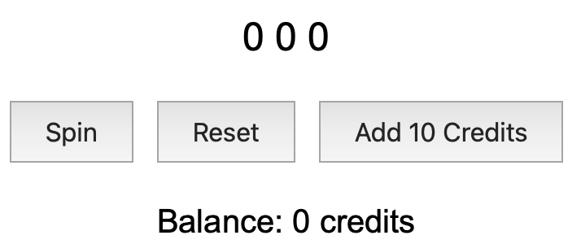

# Product Development Cradle to Grave - Part 3

This series of articles is designed as a tutorial for how to write a portable full stack service using modern techniques. I will take you on a journey from concept through deployment. The series will be detailed and therefore is closer to a book than a bunch of blog posts. Hopefully we'll all learn something along the way. I'll strive to make the series useful for software engineers at any point in their career. I will incorporate how I approach doing product development which has worked well when working with teams over my career.

# Revisit Assessment

Let's see how we are doing asking the original task list. I'll add a column:

| Task                                                            | Effort | Actual |
| --------------------------------------------------------------- | ------ | ------ |
| Setup dev environment for Go, C++ and VS Code                   | 1      | 3      |
| Write slot machine "business logic" using TDD                   | 3      | 1      |
| Create API to use slot machine business logic                   | 2      | 1+?    |
| Create a simple web page<sup>[1]</sup>                          | 3      |        |
| Write design the API to invoke the business logic<sup>[2]</sup> | 2      |        |
| Write the code to format the web page                           | 2      |        |
| Write code to display msg from server<sup>[3]</sup>             | 3      |        |
| Total Effort                                                    | 16     |        |

It's difficult to assess actual assessment because I'm writing these articles at the same time. However, I think I'm on track. For the setup task, notice how the estimated effort and actual effort is reversed. Also notice the `?` for creating the API. This is typical.

For the setup case, I spent less than 3 hours, however my computer was already setup. It took me less than 1 hour, but I'm guessing actual for a developer setting up a new tool chain would be closer to 3 hours, so I logged 3.

## The Quantum Nature of Time

Using a total effort for time is misleading. In reality, work is completed in "chunks". Everybody works like this, however, my quantum is different than yours. It also changes based on environment, mood, energy level and more.

I can work for 4-6 hours, taking 5 min breaks once an hour. During these periods I pay attention to the number of mistakes I make. When the frequency becomes noticeable, time to take break. This gives me 2 or 3 periods with durations between 2 and 6 hours. For complex stuff, I'll use the while 6 hours to prevent losing context.

## The Effect of Quality on Yield

Every production process has a yield, coding is no different. I was formally certified in the Personal Software Process (PSP) a very long time ago. It taught me how to write code that does not have defects cause by me, well, being me. Explaining this might be the subject of a future article, for now it's just about quality and yield.

I like to finish something and be done with it. When it comes back from a code review, like a pull request or from QA or the customer as a bug, it affects my yield. So, if I have to do 10% rework, I'm wasting 10% of the time I could be producing more code. This also costs my employer money, which is no big deal, until you think about why an employer hires contract talent. It's all about the money baby.

I tried to convince an employer that using off shore coders at 1/4 the cost compared to my services was a net loss. I measured the rework and time it took for me to either fix the problem or request fix-on-fix and associated documentation to convince the guys doing the work to actually fix it. Granted this was a long time ago, but actually doing the math proved my point. The quality process guy sat in the same room as me and he kinda believed me, but my management didn't.

So, I ended up just writing a lot more of the code than I should have - taking one for the team. The time came out of my personal time. So the employer saw it as a win-win. But the result is a disgruntled employee.

Suffice to say, TDD helps improve yield. It doesn't make creating the asset quicker, it makes creating the asset more _reliable_ and therefore de-risks a project and instills trust between team members and management. This leads to a happier, less toxic workplace. It also feels better.

Enough pontification, Let's get back to work.

### What's Next?

Do I work on enhancing the API or creating the simple web page at this point? I could even work on the API. It's not necessary to follow the sequence outlined in the task list. What should I choose? It depends. Mostly on what you are capable of doing at the time. If you are focused, do harder things. If you don't have a lot of time (maybe a meeting is coming up, lunch, beers and/or dinner soon?), these things will force you to rush.

I have 2 hours before lunch so I think I can do the web page and some of the API. This will allow me to use the "define the output first" approach. We can also use our "pair programmer" which adds some interest and otherwise less than exciting task. Doing the webpage will help me think about the API. So, let's do it!

# Your Personal Pair Programmer

It's 2024. ChatGPT is a relatively new and constantly improving tool we can use. There's no reason you can't use it creatively. I use it as my personal pair programmer. Let's face it, having a dedicated pair programmer as is central to Agile methodologies is a luxury few of us have. It's also not emphasized much in some practices.

I actually posted about using [AI as a pair programmer](https://www.linkedin.com/posts/joebologna_ai-artificialintelligence-ai-activity-7240476335037366272-O5gg?utm_source=share&utm_medium=member_desktop) on LinkedIn and got all positive reactions. (Yeah!)

## Methodology

Agile is a methodology. It can be used for many things. It also has "camps", SCRUM is a common camp for instance. In reality, Agile started out at "Extreme Programming" when I learned it. Over time, it was produced and adopted widely. However, if you actually study the genesis of SCRUM you will discover it was not codified by a software engineer. I suppose this is OK, however, as a practicing software engineer (trained in using techniques from the [SEI](https://sei.cmu.edu)), I can spot the flaws.

Our objective is to get this product built, so I'll refrain from a methodology discussion. Suffice to say, using a pair programmer is essential to agility and yield. TDD is essential to yield. I've seen many arguments claiming that using TDD is slower than using Agile methods. Ok, fine, this is kinda true. But let me put a finer point on it using an anecdote:

While at university we had Unix systems (Linux wasn't invented yet). We used `talk` just like chat is used today. `talk` showed you what the other person was typing as they were typing it, not just a flashing `...` like chat does today. Watching someone type slowly is actually amusing, so it passed the time. Things were slower back then because we used dumb terminals connected over serial lines. The speeds were between 300 baud (line speed of 240 bps) and 9600 baud (line speed of 7680 bps). But I digress.

Anyway, we'd use `talk` with our professor who could type phenomenally fast. He also made mistakes phenomenally fast. He'd backspace over words faster than Tom Hanks in "You've Got Mail." Of course, we had to wait until he was done typing to figure out what he was trying to communicate. While waiting we'd laugh and say "he's making mistakes at 9600 baud". Moral of the story: his yield was terrible. He might as well been on a 300 baud connection, it wouldn't have mattered. That's yield.

So, unless you are producing code that doesn't need to be revised your golden. It will get through peer review and QA an end up in production. Shooting 100%. When mistakes come back, yield drops. I'm OK with having 1 mistake come back after claiming my code is done. After than I get upset with myself and remind myself to go back to basics. People I work with, usually don't subscribe to this method. They're comfortable with some "technical debt" and they fix it all the time. This is fine and all, but re-work is re-work and it usually comes at a bad time or interferes with creating a new asset. Sometimes for weeks or longer.

If this doesn't bother you, think about the poor soul picking up a project you leave. That person has a learning curve and maybe just the code to look at, and oh yeah, some deadline to fix or create something. Leaving technical debt for the future puts people joining your project at a disadvantage. You might be a team lead, what happens? You'll start writing the, usually the harder stuff and it negates adding someone to the project in the first place. Admittedly, I'm exaggerating, but I hope you get the point.

Suffice to say, using an AI as a pair programmer is better than nothing. Since it's just me doing this project soup to nuts, that's what I'll do.

## Prompt for a Simple Web Page

I'll let "the other guy" (ChatGPT) write some code and I'll be the pair programmer. Since we need a web page, lets just ask for it along with some details.

```
Prompt: write me code to display a web page like this:

[number][number][number] [spin button][reset button][add 10 credits]
balance: {number of credits}
```

Response:

```html
<!DOCTYPE html>
<html lang="en">
  <head>
    <meta charset="UTF-8" />
    <meta name="viewport" content="width=device-width, initial-scale=1.0" />
    <title>Spin Game</title>
    <style>
      body {
        font-family: Arial, sans-serif;
        text-align: center;
        margin-top: 50px;
      }
      .numbers {
        font-size: 24px;
        margin-bottom: 20px;
      }
      button {
        margin: 5px;
        padding: 10px 20px;
        font-size: 16px;
      }
      .balance {
        margin-top: 20px;
        font-size: 20px;
      }
    </style>
  </head>
  <body>
    <div class="numbers">
      <span id="number1">0</span>
      <span id="number2">0</span>
      <span id="number3">0</span>
    </div>

    <button id="spinButton">Spin</button>
    <button id="resetButton">Reset</button>
    <button id="addCreditsButton">Add 10 Credits</button>

    <div class="balance">Balance: <span id="balance">0</span> credits</div>

    <script>
      let balance = 0;

      document.getElementById('spinButton').addEventListener('click', function () {
        // Generate three random numbers between 0 and 9
        document.getElementById('number1').textContent = Math.floor(Math.random() * 10);
        document.getElementById('number2').textContent = Math.floor(Math.random() * 10);
        document.getElementById('number3').textContent = Math.floor(Math.random() * 10);
      });

      document.getElementById('resetButton').addEventListener('click', function () {
        // Reset the numbers to 0
        document.getElementById('number1').textContent = 0;
        document.getElementById('number2').textContent = 0;
        document.getElementById('number3').textContent = 0;
      });

      document.getElementById('addCreditsButton').addEventListener('click', function () {
        // Add 10 credits to the balance
        balance += 10;
        document.getElementById('balance').textContent = balance;
      });
    </script>
  </body>
</html>
```

What does this look like?



Good enough to start with - that took all of 10 seconds. Nice.

## Extending the API

Now that we have some idea of the output required, we need to add functionality, so let's describe this in a list:

- Provide the wheel values (almost done)
- Spin (done)
- Reset the balance
- Add 10 to the balance
- Provide the balance

We have enough to start writing an interface as the basis of the implementation.

### Using Go Interfaces

This is a good time to introduce Go interfaces. A Go interface can actually define the API for us.

It is also easy to write code generators because Go provides something called `AST`. We'll probably use a code generator later, for now let's just define the interface.

#### ChatGPT Interaction to Generate the Go Interface

Let's pawn writing the interface off on our pair programmer.

Prompts:

1. write me a go interface that has the following capabilities:

- a spin function that accepts a seed and returns a slice of ints
- a reset function
- a update balance function that accepts an int
- a getbalance function that returns an int

2. add a construct to force implementation of the interface

Output after the 2nd prompt:

In Go, you can enforce the implementation of an interface by using a compile-time assertion. This is done by creating a variable of the interface type and assigning an instance of the struct that implements the interface to it. If the struct does not implement the interface, the code will not compile.

Here's how you can modify the previous example to include a construct that forces the implementation of the `Spinner` interface:

```go
package main

import "fmt"

// Spinner interface defines the required methods for a spinner.
type Spinner interface {
	Spin(seed int) []int          // Spin accepts a seed and returns a slice of ints
	Reset()                       // Reset resets the spinner's state
	UpdateBalance(amount int)     // UpdateBalance updates the balance by the given amount
	GetBalance() int              // GetBalance returns the current balance
}

// MySpinner struct implements the Spinner interface.
type MySpinner struct {
	balance int
}

// Ensure MySpinner implements the Spinner interface.
var _ Spinner = (*MySpinner)(nil) // This line enforces the implementation at compile time.

// Spin generates a slice of random integers based on the seed.
func (s *MySpinner) Spin(seed int) []int {
	// Example implementation: generate a slice of integers based on the seed
	return []int{seed, seed + 1, seed + 2} // Just a placeholder
}

// Reset resets the spinner's state.
func (s *MySpinner) Reset() {
	s.balance = 0 // Reset balance to 0
}

// UpdateBalance updates the balance by the given amount.
func (s *MySpinner) UpdateBalance(amount int) {
	s.balance += amount
}

// GetBalance returns the current balance.
func (s *MySpinner) GetBalance() int {
	return s.balance
}

func main() {
	// Example usage
	var spinner Spinner = &MySpinner{}
	spinner.UpdateBalance(100)
	spinResult := spinner.Spin(42)
	currentBalance := spinner.GetBalance()

	// Output the results
	fmt.Println("Spin Result:", spinResult)
	fmt.Println("Current Balance:", currentBalance)

	// Reset the spinner
	spinner.Reset()
	fmt.Println("Balance after reset:", spinner.GetBalance())
}
```

Explanation of the Enforcement:

- The line `var _ Spinner = (*MySpinner)(nil)` is a compile-time assertion that checks whether `MySpinner` implements the `Spinner` interface. If `MySpinner` does not implement all the methods defined in the `Spinner` interface, the code will not compile, and you will receive an error.
- This pattern is commonly used in Go to ensure that a struct adheres to an interface, providing a safeguard against accidental changes that might break the contract defined by the interface.

#### Evaluating the ChatGPT Response

The response has more than we bargained for. It includes a struct to hold the balance and getter and update methods to mutate it. The main() even does some unit testing, smart.

### Updating the Go API

Using this data we can now update `vslot/vslot.go` and `vslot_test.go`.

There is no compelling reason to put the interface in it's own file just yet. For now, lets just update `vslot.go`.

### TDD to the rescue

Ok, so writing the unit tests for this wasn't quite as simple as I expected. So, I'm into some refactoring. The issue is regarding the behavior of `rand`. This code fails to set `is_win` to true:

```go
func TestBalance(t *testing.T) {
	a := assert.New(t)
	rand.Seed(0)

	v := MyVSlot{}
	a.Equal(v.GetBalance(), 0)

	spin_result := v.Spin(0)
	is_win := spin_result == spin0 // spin0 is [2,8,8], spin_result is [5,5,4]
	a.True(is_win)

	if is_win {
		v.UpdateBalance(10)
		a.Equal(10, v.GetBalance())
	} else {
		a.FailNow("should have won")
	}
}
```

I figured this out using the Go debugger. I'm not sure why, but I suspect it is because Go tests are run in parallel. Thinking about this more I observed that I the debugger to perform the test, which means it did not run in parallel. So now I suspect it's something different.

Noodle... noodle... oh, crap. Globals are fine in Go tests, but `rand.Intn(10)` is called when the globals are initialized. This is wrong because the seed is not set yet and `rand` does not report an error (by design it seems), so I suppose it just uses a random seed. It really doesn't matter. The globals need to be set in a setup function anyway, so that's what we'll do.

Thinking about this even further, it seems initializing the random number generator should be more controlled. This will avoid this nasty behavior from creeping in at a later date. It might just save some poor soul in the future some time. So we should consider adding some protections. That's a little complicated and we want to remain focused so, let's just put it on the list of things to fix (ok, we're adding technical debt - fine). We can just add `// REVIEW` to the line of code and my handy Todo+ extension will flag it in the future.

We'll also likely need to use globals, in the tests. This should be done with care. This means we need a `TestMain()` function to accomplish this.

### Refactored Go Code

At this point, it was time to reconsider what I'd done thus far. I concluded that a refactor was needed. After trying a few things to get the tests to work, it became obvious that I'd neglected to create a "New" function to create a MyVSlot object. So, I refactored by hand (instead of using AI).

This is the result:

**vslot/vslot.go**

```go
package vslot

import "math/rand"

// VSlot interface defines the required methods for implementing a virtual slot machine.
type VSlot interface {
	Spin() [3]int             // Spin accepts a seed and returns a slice of ints
	Reset()                   // Reset resets the spinner's state
	UpdateBalance(amount int) // UpdateBalance updates the balance by the given amount
	GetBalance() int          // GetBalance returns the current balance
}

// MyVSlot struct implements the Spinner interface.
type MyVSlot struct {
	balance int
}

// Ensure MySpinner implements the Spinner interface.
var _ VSlot = (*MyVSlot)(nil) // This line enforces the implementation at compile time.

func NewMyVSlot(seed int64) *MyVSlot {
	m := MyVSlot{}
	m.balance = 0
	rand.Seed(seed)
	return &m
}

// Spin generates a slice of random integers based on the seed.
func (s *MyVSlot) Spin() [3]int {
	return [3]int{rand.Intn(10) + 1, rand.Intn(10) + 1, rand.Intn(10) + 1}
}

// Reset resets the spinner's state.
func (s *MyVSlot) Reset() {
	s.balance = 0 // Reset balance to 0
}

// UpdateBalance updates the balance by the given amount.
func (s *MyVSlot) UpdateBalance(amount int) {
	s.balance += amount
}

// GetBalance returns the current balance.
func (s *MyVSlot) GetBalance() int {
	return s.balance
}
```

**vslot/vslot_test.go**

```go
package vslot

import (
	"flag"
	"math/rand"
	"os"
	"testing"

	"github.com/stretchr/testify/assert"
)

var (
	spin0, spin1 [3]int
	myVSlot      *MyVSlot
)

// might need to run with -parallel=1
func TestMain(m *testing.M) {
	flag.Parse()
	setup()

	code := m.Run()

	// teardown()

	os.Exit(code)
}

func setup() {
	myVSlot = NewMyVSlot(0)
	spin0 = [3]int{rand.Intn(10) + 1, rand.Intn(10) + 1, rand.Intn(10) + 1}
	spin1 = [3]int{rand.Intn(10) + 1, rand.Intn(10) + 1, rand.Intn(10) + 1}
}

func TestSpin(t *testing.T) {
	a := assert.New(t)

	myVSlot = NewMyVSlot(0)

	spin_result := myVSlot.Spin()
	a.Equal(spin0, spin_result)
}

func TestTwoSpins(t *testing.T) {
	a := assert.New(t)

	myVSlot = NewMyVSlot(0)

	spin_result := myVSlot.Spin()
	a.Equal(spin0, spin_result)

	spin_result = myVSlot.Spin()
	a.Equal(spin1, spin_result)
}

func TestBalance(t *testing.T) {
	a := assert.New(t)

	myVSlot = NewMyVSlot(0)
	a.Equal(myVSlot.GetBalance(), 0)

	spin_result := myVSlot.Spin()
	a.Equal(spin0, spin_result)

	myVSlot.UpdateBalance(10)
	a.Equal(10, myVSlot.GetBalance())
}

func TestReset(t *testing.T) {
	a := assert.New(t)

	myVSlot = NewMyVSlot(0)
	a.Equal(myVSlot.GetBalance(), 0)

	spin_result := myVSlot.Spin()
	a.Equal(spin0, spin_result)

	myVSlot.UpdateBalance(10)
	a.Equal(10, myVSlot.GetBalance())

	myVSlot.Reset()
	a.Equal(0, myVSlot.GetBalance())
}
```

Let's run the tests and check code coverage:

```console
go test -cover
```

Output:

```console
PASS
coverage: 100.0% of statements
ok  	slots/vslot	0.447s
```

Yeah! We now have a functional vslot package.

#### ChatGPT Interaction to Generate the C++ Code

Let's try to get ChatGPT to do this for us. Maybe it will just rewrite the Go code.

Prompt: convert this code to C++:

_paste vslot/vslot.go here_

Response:

Here's the equivalent C++ code for your Go implementation:

```c++
#include <iostream>
#include <cstdlib>
#include <ctime>
#include <array>

// VSlot interface defines the required methods for implementing a virtual slot machine.
class VSlot {
public:
    virtual std::array<int, 3> Spin() = 0;             // Spin generates a slice of random integers
    virtual void Reset() = 0;                          // Reset resets the spinner's state
    virtual void UpdateBalance(int amount) = 0;        // UpdateBalance updates the balance by the given amount
    virtual int GetBalance() const = 0;                // GetBalance returns the current balance
    virtual ~VSlot() = default;                        // Virtual destructor for proper cleanup
};

// MyVSlot class implements the VSlot interface.
class MyVSlot : public VSlot {
private:
    int balance;

public:
    MyVSlot(int64_t seed) : balance(0) {
        std::srand(seed);
    }

    std::array<int, 3> Spin() override {
        return {std::rand() % 10 + 1, std::rand() % 10 + 1, std::rand() % 10 + 1};
    }

    void Reset() override {
        balance = 0; // Reset balance to 0
    }

    void UpdateBalance(int amount) override {
        balance += amount;
    }

    int GetBalance() const override {
        return balance;
    }
};

int main() {
    MyVSlot slotMachine(time(0)); // Initialize with current time as seed

    // Example usage
    auto result = slotMachine.Spin();
    std::cout << "Spin result: " << result[0] << " " << result[1] << " " << result[2] << std::endl;

    slotMachine.UpdateBalance(100);
    std::cout << "Balance after update: " << slotMachine.GetBalance() << std::endl;

    slotMachine.Reset();
    std::cout << "Balance after reset: " << slotMachine.GetBalance() << std::endl;

    return 0;
}
```

Not bad, let's see if it will add the unit tests.

Prompt: replace the example using main to unit tests using doctest.h

Response:

```c++
#define DOCTEST_CONFIG_IMPLEMENT_WITH_MAIN
#include "doctest.h"
#include <array>
#include <cstdlib>
#include <ctime>

// VSlot interface defines the required methods for implementing a virtual slot machine.
class VSlot {
public:
    virtual std::array<int, 3> Spin() = 0;
    virtual void Reset() = 0;
    virtual void UpdateBalance(int amount) = 0;
    virtual int GetBalance() const = 0;
    virtual ~VSlot() = default;
};

// MyVSlot class implements the VSlot interface.
class MyVSlot : public VSlot {
private:
    int balance;

public:
    MyVSlot(int64_t seed) : balance(0) {
        std::srand(seed);
    }

    std::array<int, 3> Spin() override {
        return {std::rand() % 10 + 1, std::rand() % 10 + 1, std::rand() % 10 + 1};
    }

    void Reset() override {
        balance = 0;
    }

    void UpdateBalance(int amount) override {
        balance += amount;
    }

    int GetBalance() const override {
        return balance;
    }
};

TEST_CASE("Testing MyVSlot class") {
    MyVSlot slotMachine(12345); // Initialize with a fixed seed for reproducibility

    SUBCASE("Spin generates three numbers between 1 and 10") {
        auto result = slotMachine.Spin();
        CHECK(result[0] >= 1);
        CHECK(result[0] <= 10);
        CHECK(result[1] >= 1);
        CHECK(result[1] <= 10);
        CHECK(result[2] >= 1);
        CHECK(result[2] <= 10);
    }

    SUBCASE("Balance updates correctly") {
        slotMachine.UpdateBalance(100);
        CHECK(slotMachine.GetBalance() == 100);

        slotMachine.UpdateBalance(-50);
        CHECK(slotMachine.GetBalance() == 50);
    }

    SUBCASE("Reset sets balance to zero") {
        slotMachine.UpdateBalance(100);
        slotMachine.Reset();
        CHECK(slotMachine.GetBalance() == 0);
    }
}
```

Bad ass!

We need to make a few tweaks to test.

1. Change the test name to MyVSlotTest
2. Update tests/CMakeLists.txt, setting the test name to MyVSlotTest

Let's test it:

```console
cd build; cmake ..; make; ctest; cd ..
```

Output:

```console
-- File already exists: /Users/joeb/Projects/2024/rockyourslotsoff/src/Cpp/doctest.h
-- Configuring done (0.0s)
-- Generating done (0.0s)
-- Build files have been written to: /Users/joeb/Projects/2024/rockyourslotsoff/src/Cpp/build
[ 50%] Built target HelloWorld
[100%] Built target test_vslot
Test project /Users/joeb/Projects/2024/rockyourslotsoff/src/Cpp/build
    Start 1: MyVSlotTest
1/1 Test #1: MyVSlotTest ......................   Passed    0.00 sec

100% tests passed, 0 tests failed out of 1

Total Test time (real) =   0.01 sec
```

Success (happy dance).

### Evaluate C++ Tests

It's obvious that ChatGPT tested the MyVSlot class differently than I did. It did use a fixed seed, which I expected - so it passes the hallucination test. However, I have no issue with the actual implementation because it is functionally equivalent. I can't think of a reason to make changes or enhancements. So we're done!

# Summary

At this point we've finished the "business logic". But we've not created the API. So, it's pretty obvious that getting to this point required more effort than expected. Not to worry, by using TDD and interfaces things will go a lot faster as we progress. In theory, the API should be a piece of cake now.

I'm familiar with the Go tools for making APIs. I'm not familiar with C++ yet, so this will take a little more work.

However, initially, we will generate the webpage by just spitting out a static representation of the slot machine, then refreshing the entire page. When this works, we'll make the page dynamic by using JSON/RPC calls from the web page to the server over HTTP, probably using a websocket.
